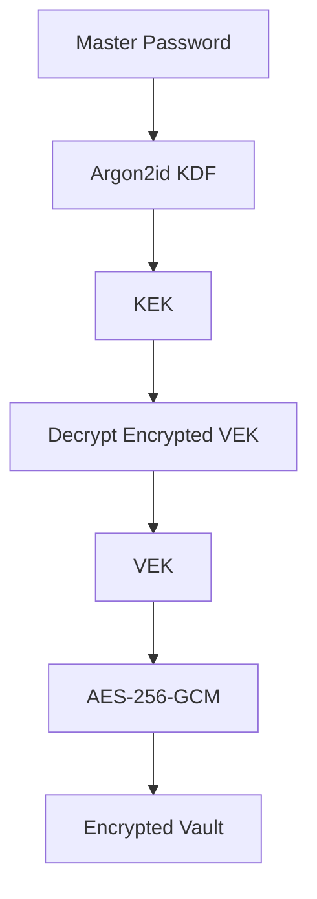

# SecureVault Architecture

## Overview

SecureVault is a zero-knowledge password manager. The backend stores encrypted vault material but can never decrypt it. All cryptography happens client-side.

## Components

### Backend (Rust + Axum)
- Stateless HTTP API
- Handles authentication (sessions), device management, and encrypted vault storage
- Never receives plaintext passwords, master passwords, or vault keys

### Frontend (Next.js + TypeScript)
- Client-side key derivation and encryption
- Local vault search and analysis
- Password generation using `crypto.getRandomValues`

### Database (PostgreSQL)
- Stores user accounts, session hashes, device info, encrypted vault material
- Backend roles with least privilege

## Key Flow



## Authentication vs. Unlock

Two distinct layers:
1. **Server authentication** — email/password (hashed server-side) or passkey. Determines if a user may access their encrypted vault.
2. **Vault unlock** — master password derived locally. Determines if the client can decrypt the vault.

These use different secrets and different mechanisms.

## Data Flow

```
Client decrypts vault locally
    ↓
User edits credentials
    ↓
Client re-encrypts vault with VEK
    ↓
Client uploads ciphertext via PUT /api/v1/vault
    ↓
Server stores encrypted blob
```

## Sync & Conflict Resolution

Each vault has a monotonically increasing `version`. When an update arrives with a version <= current, a conflict is detected rather than silently overwriting. Clients download both versions and merge locally.
