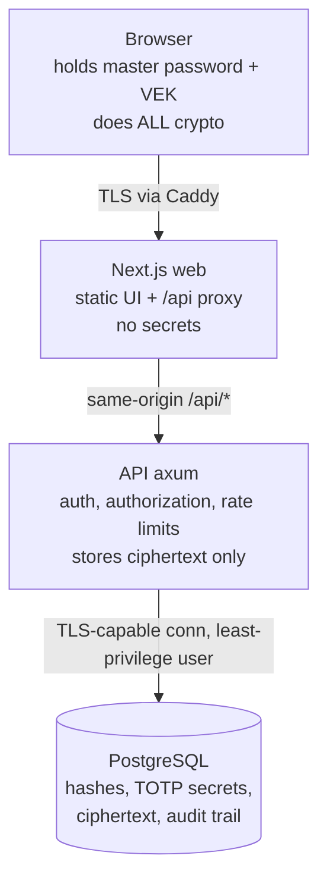

# Security

Reference for the security posture of SecureVault — what is enforced where,
what the server can and cannot see, and which risks remain. The
zero-knowledge design details live in `docs/crypto.md` and
`docs/threat-model.md`; this page is the operational inventory.

## Security boundaries

The client is never trusted. Every permission decision happens in the API:
the session cookie is resolved per request, the role is re-read from the
database on every request, and admin routes re-check via `ensure_admin`.
Hiding UI elements is cosmetic only.

## Server's knowledge boundary

| Never received | Received (stored) |
|---|---|
| Master password | Account email |
| Vault Encryption Key (VEK) | Argon2id account-password hash |
| KEK / Secret Key / recovery key | Wrapped VEK (under KEK and under Secret Key) |
| Vault items in plaintext | AES-256-GCM vault ciphertext + nonce |

Consequence: a full database leak does not expose vault items, but it *is*
serious (password hashes crackable offline, **reversible TOTP secrets**,
ciphertext for offline brute-force against weak master passwords). Treat the
database as secret-adjacent: encrypted backups, restricted network, least
privilege.

## Implemented protections (with pointers)

**Authentication & sessions**
- Account passwords: Argon2id (`crates/crypto`), minimum 12 chars, validated server-side.
- Login timing: unknown emails burn an Argon2id verification against a dummy hash → uniform response time, no account enumeration (`routes/auth.rs::login`).
- Sessions: 64-char random tokens, stored only as SHA-256 hashes, 24 h expiry, `HttpOnly; SameSite=Lax` cookies; `Secure` is **forced** under `APP_ENV=production` (`config::session_cookie_attributes`).
- TOTP 2FA (RFC 6238): half-sessions that can reach nothing but the challenge endpoint; challenge endpoint is rate-limited (6-digit codes are brute-forceable otherwise); disabling needs code **and** password.
- Passkeys: full WebAuthn verification (CBOR/COSE, ES256/RS256, origin/RP-ID binding, UV required, sign-count replay protection).
- Login/register/passkey-login/challenge: per-IP fixed-window rate limits (10/min login-class, 5/5 min register) — in-memory, single-instance deployment model.

**Authorization**
- Roles `user`/`admin` re-read per request; admin surface gated twice (extractor + `ensure_admin`); self-role-change and last-admin demotion refused.
- Account deletion requires the account password (stolen sessions alone cannot delete an account silently); admin-initiated deletion cannot target the acting admin or the last admin. Deletion re-points audit events to a tombstone so the trail outlives the user (`routes/account.rs`).
- No first-user-admin in production — `APP_ENV=production` disables the bootstrap and warns; admins are promoted explicitly.

**Transport & headers**
- Automatic HTTPS via Caddy (Let's Encrypt) + HSTS `max-age=31536000`.
- API responses: `X-Content-Type-Options: nosniff`, `X-Frame-Options: DENY`, `Referrer-Policy: no-referrer`, restrictive CSP. HSTS intentionally left to the TLS proxy.
- Request bodies capped at 2 MiB (`RequestBodyLimitLayer`, `MAX_BODY_BYTES`) → oversized uploads get `413` before handlers run.
- CORS: credentialed allow-list from `CORS_ORIGINS`; empty/`*` only meaningful in dev.

**Input validation & integrity**
- Multi-layer: API boundary (email shape, base64, 12-byte nonces, 48-byte wraps, version arithmetic) → business rules (version conflicts `409`) → database constraints (FKs, unique `(user_id, version)`, CHECK constraints on roles).
- Vault uploads are validated per-key-wrap with exact byte-length checks before any storage.

**Audit & forensics**
- Every sensitive action audited (`USER_REGISTERED` … `ADMIN_SESSIONS_REVOKED`, `ACCOUNT_DELETED_*`), with **salted SHA-256 IP hashes** (`AUDIT_IP_SALT`, raw IPs never stored, salt stable per deployment for correlation).
- Admin actions record actor + target; console *views* are not logged by design.

**Data lifecycle**
- Hourly maintenance: expired sessions purged; revoked sessions purged after a 7-day grace; snapshot retention (`SNAPSHOT_RETENTION_COUNT`, newest always kept).

## Secret management

| Secret | Where | Notes |
|---|---|---|
| `POSTGRES_PASSWORD` | `.env.prod` (host, chmod 600, git-ignored) | never in the repo |
| `SESSION_SECRET` | `.env.prod` | reserved (tokens are random, not signed) |
| `AUDIT_IP_SALT` | `.env.prod` | stable per deployment for IP-hash correlation |
| TLS certificates | Caddy volume | auto-managed |
| `.env` (dev) | local only | git-ignored; seeded demo creds are dev-only |

`.env.example` and `.env.prod.example` are committed **templates only**.
CI/CD uses repository secrets (`DEPLOY_*`) for the SSH deploy; they are never
echoed into logs.

## Known residual risks (honest list)

- **TOTP secrets are reversible in the DB.** Required for login verification.
  A DB leak breaks 2FA's second factor for leaked accounts (vault stays safe).
- **In-memory rate limiting is per-process.** Scale to >1 API instance and
  limits must move to shared storage (Redis) — the single-instance compose
  stack is the current supported model.
- **No email verification / password-reset flow.** Losing the account
  password with no existing session means account loss (by design there is no
  server-side vault recovery either; the Secret Key is the vault recovery).
- **No forced re-auth for sensitive actions** other than the ones listed
  (deletion, 2FA-disable). Changing the master password re-proves vault
  knowledge client-side by design.
- **Malware/keyloggers on an unlocked device defeat everything.** Out of
  scope for any web app; see `docs/threat-model.md`.
- WebAuthn sign-count checking is best-effort across authenticator models
  (some always report 0); the verifier tolerates this rather than locking
  users out.

## Reporting

Security issues: contact the operator/maintainer privately (no mailto is
published in this repo yet — add one before public launch). Please include
reproduction steps; vault-ciphertext samples are fine (they're the point),
plaintext never needs to be shared.
